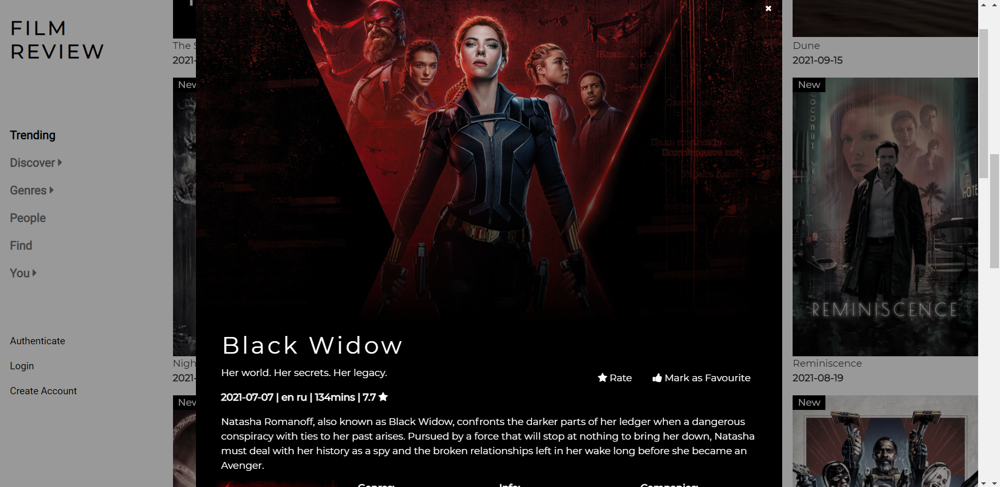
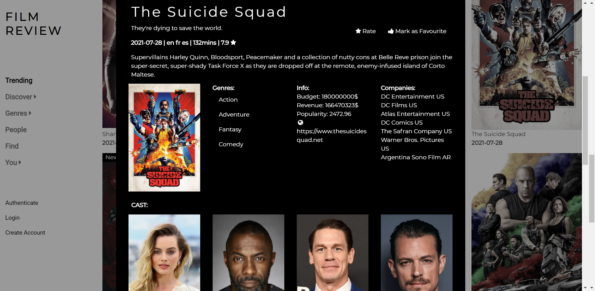
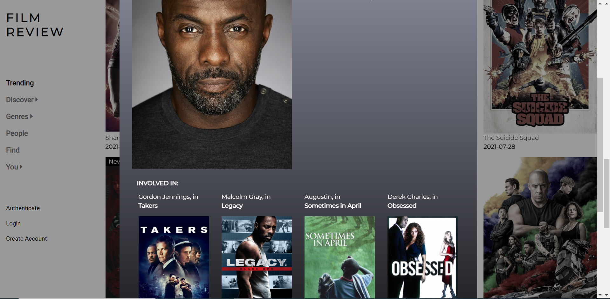

COMP1101 Programming Summative Assessment 2 2018-19
===================================================

Server Side Documentation
=========================

project by clvp22, Durham University.

Overview
--------

My project is a film review website that allows you to browse through a variety of films and people (cast/crew) provided by an external api. You can view the details of films, search for films, search for people, rate films, favourite films and discover films, based on genre for example.

Prelims
-------

This webpage uses the external api TMDb, so to make the most out of this webpage please create an account at https://www.themoviedb.org/account/signup 
or use my dummy account {username: dummy49, password: password49}, but bear in mind other people may have used it before. You can also access this link on the webpage itself through the create account button.
This is important as it will help demonstrate the use of my POST requests.

Running the server
------------------

Using comand and prompt please make your way to this files directory, using 'cd' and 'dir' commands if necessary. Type 'npm install' into the command line and wait for the modules to install. 
Then type 'npm start' to launch the server; ctrl^C will terminate the server at any time and if the server terminated for whatever reason type 'npm start' again to relaunch the server. 

Accessing the webpage
---------------------

Access the webpage at the local address: http://127.0.0.1:8090

Testing
-------

- There is one test file 'app.test.js' to run these tests simply type 'npm test' into the command line (this will run jest --coverage). Bear in mind that some of the tests may fail because of the external api service, and if the 'GET /authentication/session/new redirect succeeds' test fails then most of the tests in the 'Test account services' section will also fail because the authentication has not worked. 
- To test with eslint type 'npm run lint' into the command line, this is a directory wide test and will test the client side javascript aswell. If you don't see any output this means eslint has found no errors.  

Console
-------

Things that appear on the console:
 - **Api requests** - when an api request is made (GET, POST or DELETE) the console will log: 'api request at: {URL}'.
 - **Pagination** - when a new page of data is requested the console will log what page is attempting to be accessed 'acessing page {page number} ...'.
 - **Authentication** - when a new session is being posted the console will log: 'token: {token}', 'approved: {approved}' and 'Success session created at: {session_id}' if the request is successful.
 - **POST/DELETE request** - when a POST or DELETE request is made to the api the console will log: 'api request at: {URL}', 'body: {body}'.
 - **Error** - when an api error or a server side error occurs for whatever reason, the console will log it.
 
Using the webpage
-----------------

The rest of the information about using the actual website can be found in the client side README.md ... client/README.md

Screenshots
-----------------

License
-------

This work is licensed under the Creative Commons Attribution-ShareAlike 3.0 Unported License. To view a copy of this license, visit http://creativecommons.org/licenses/by-sa/3.0/ or send a letter to Creative Commons, PO Box 1866, Mountain View, CA 94042, USA.

